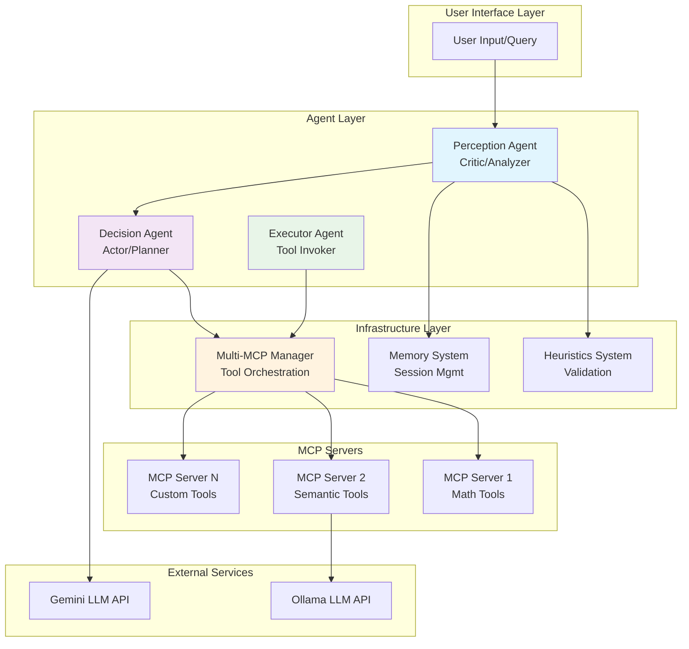
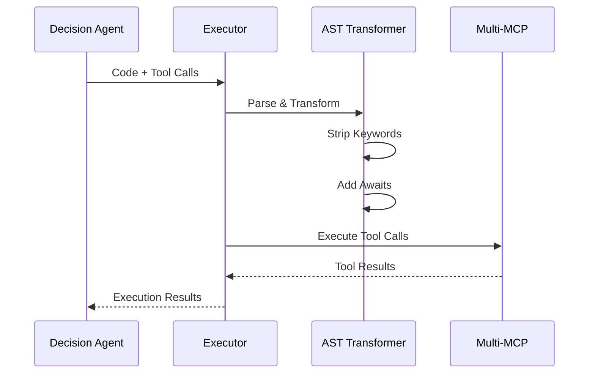
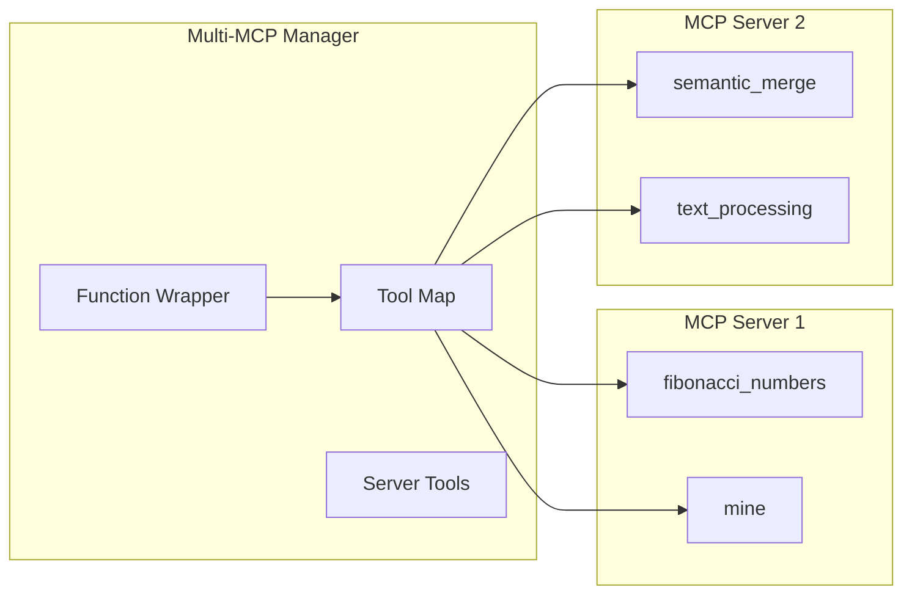
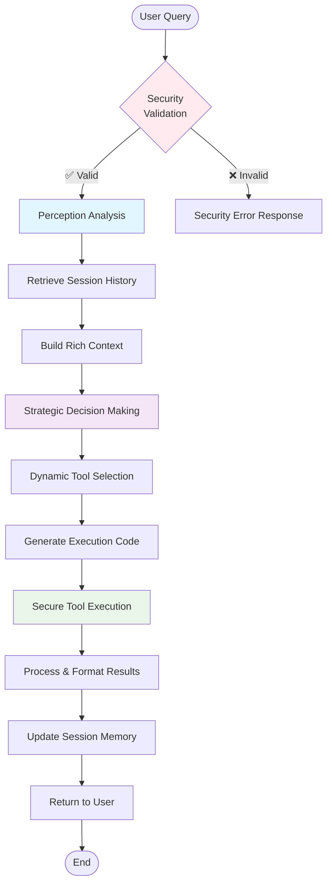
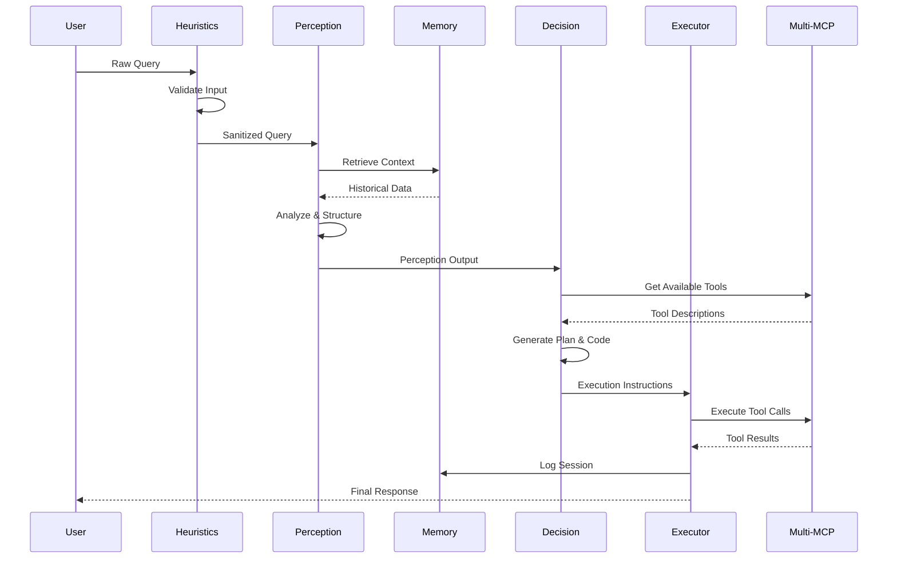

## Repository File Structure

```
.
├── mcp_servers/
│   ├── mcp_server_1.py          # Fibonacci and mining tools MCP server
│   ├── mcp_server_2.py          # Semantic processing MCP server  
│   └── multiMCP.py              # Multi-MCP orchestration manager
├── perception/
│   └── perception.py            # Perception agent (critic/analyzer)
├── decision/
│   └── decision.py              # Decision agent (actor/planner)
├── action/
│   └── executor.py              # Executor agent (tool invoker)
├── heuristics/
│   └── heuristics.py            # Input validation and security
├── memory/
│   └── session_log.py           # Session persistence and management
└── modules/
    └── tools.py                 # Tool utilities and helpers
```

# Agentic AI Framework Architecture

## Overview

This is a modular, production-ready Agentic AI framework implementing the **Perception-Decision-Action (PDA)** pattern with Model Context Protocol (MCP) integration. The system uses a multi-agent architecture where specialized agents collaborate to process user queries, make intelligent decisions, and execute actions through external tools.

## High-Level Architecture



## Core Components

### 1. Perception Agent (`perception/perception.py`)

**Role:** System's critic and input analyzer

**Key Responsibilities:**
- Process raw user input with contextual understanding
- Integrate historical memory from previous sessions
- Generate structured perception snapshots
- Interface with Gemini LLM for intelligent analysis

**Key Features:**
```python
class Perception:
    def build_perception_input(self, raw_input: str, memory: list, 
                             current_plan: str = "", snapshot_type: str = "user_query") -> dict
    def run(self, perception_input: dict) -> dict
```

- UUID-based run tracking for session management
- Timestamp and schema versioning support
- Memory integration with query/result/solution patterns
- Graceful error handling for LLM service failures

### 2. Decision Agent (`decision/decision.py`)

**Role:** System's actor and strategic planner

**Key Responsibilities:**
- Process perception output to make execution decisions
- Interface with Multi-MCP system for dynamic tool selection
- Generate step-by-step execution plans with code generation
- Handle LLM service errors with fallback mechanisms

**Key Features:**
```python
class Decision:
    def run(self, decision_input: dict) -> dict
```

- Dynamic tool description injection
- Multi-step planning with code generation capabilities
- JSON parsing with error recovery mechanisms
- Integration with complete MCP tool ecosystem

### 3. Executor Agent (`action/executor.py`)

**Role:** Executes decisions through secure tool invocation

**Key Security Features:**
- **AST-based Code Transformation:** `KeywordStripper` removes unsafe keyword arguments
- **Safe Execution Environment:** Restricted globals with whitelisted modules
- **Async Tool Integration:** Auto-await transformer for MCP tools
- **Timeout Protection:** Per-function and total execution timeouts

```python
# Security-focused execution environment
ALLOWED_MODULES = {
    "math", "cmath", "decimal", "fractions", "random", "statistics", 
    "itertools", "functools", "operator", "string", "re", "datetime",
    # ... safe modules only
}
MAX_FUNCTIONS = 5
TIMEOUT_PER_FUNCTION = 500  # seconds
```

**Execution Flow:**


### 4. Heuristics System (`heuristics/heuristics.py`)

**Role:** Comprehensive input validation and security enforcement

**Security Validation Categories:**

1. **URL Security:**
```python
def _check_url(self, query: str) -> Tuple[bool, str]:
    # Extracts URLs from natural language
    # Enforces HTTPS protocols
    # Validates accessibility with timeout
```

2. **File System Security:**
```python
def _check_file_path(self, query: str) -> Tuple[bool, str]:
    # Validates file paths exist before access
    # Prevents directory traversal attacks
```

3. **Input Length & Pattern Security:**
```python
def _check_sentence_length(self, query: str) -> Tuple[bool, str]:
    # 100-character sentence limits (DoS prevention)
    # Detects repetitive patterns (injection attempts)
    # Validates content concatenation
```

4. **Content Security:**
```python
def _check_blacklist(self, query: str) -> Tuple[bool, str]:
    # Blocks malicious keywords
    # Extensible blacklist system
```

### 5. Memory System (`memory/session_log.py`)

**Role:** Session persistence and historical context management

**Storage Architecture:**
```
memory/session_logs/
├── 2024/
│   ├── 01/
│   │   ├── 15/
│   │   │   ├── session-uuid-1.json
│   │   │   └── session-uuid-2.json
```

**Key Features:**
- **Hierarchical Storage:** Date-based organization for efficient retrieval
- **Corruption Recovery:** Automatic JSON validation and repair
- **Live Updates:** Real-time session state persistence
- **Simplified IDs:** Short session IDs for logging/display

### 6. Multi-MCP System (`mcp_servers/multiMCP.py`)

**Role:** Orchestrates multiple Model Context Protocol servers

**Architecture:**


**Key Features:**
- **Dynamic Tool Discovery:** Automatic enumeration across all servers
- **Unified Interface:** Single API for multiple MCP backends  
- **Function Call Parsing:** Supports structured and string-based invocations
- **Error Isolation:** Server failures don't cascade to other components

**Function Wrapper Example:**
```python
async def function_wrapper(self, tool_name: str, *args):
    # Handles both: fibonacci_numbers(10) and "fibonacci_numbers(10)"
    # Auto-maps positional args to tool schemas
    # Returns normalized results across all tool types
```

### 7. Tool Utilities (`modules/tools.py`)

**Role:** Helper utilities for tool management and processing

**Key Functions:**
- **JSON Block Extraction:** Safe parsing of LLM-generated JSON
- **Tool Summarization:** Dynamic tool description generation
- **Tool Filtering:** Hint-based tool selection
- **Input Wrapping Detection:** Automatic parameter wrapping logic

## MCP Server Implementations

### Server 1: Mathematical Tools (`mcp_servers/mcp_server_1.py`)
```python
def fibonacci_numbers(input: FibonacciInput) -> FibonacciOutput:
    # Generates Fibonacci sequences with input validation
    
def mine(input: MineInput) -> MineOutput:
    # Specialized computation: a - b - b
```

### Server 2: Semantic Processing (`mcp_servers/mcp_server_2.py`)
```python
def semantic_merge(text: str) -> list[str]:
    # Intelligent text segmentation using Ollama LLM
    # Detects topic boundaries and reuses content intelligently
    # 512-word chunk processing with overflow handling
```

## System Data Flow



## Communication Patterns

### Agent Communication Flow


## Security Architecture

### Multi-Layer Security Model

1. **Input Layer Security (Heuristics)**
   - Length validation (100-char sentence limit)
   - Pattern detection for injection attempts  
   - URL protocol enforcement (HTTPS-only)
   - File path validation
   - Blacklist filtering with sanitization

2. **Execution Layer Security (Executor)**
   - AST-based code transformation
   - Restricted execution environment
   - Module whitelist enforcement
   - Function count limits (max 5 per execution)
   - Timeout protections (500s per function)

3. **Tool Layer Security (MCP)**
   - Server isolation (failures don't cascade)
   - Input parameter validation
   - Safe JSON parsing with error recovery

## Technology Stack & Dependencies

- **Core Language:** Python 3.11+
- **LLM Integration:** 
  - Google Gemini API (primary)
  - Ollama API (semantic processing)
- **Protocol:** Model Context Protocol (MCP)
- **Data Serialization:** JSON for all inter-component communication
- **Storage:** File-based hierarchical session persistence
- **Architecture:** Async/await agent-based microservices
- **Security:** AST transformation, whitelisted execution environment

## Performance Characteristics

- **Stateless Agents:** Independent scaling of each component
- **Async I/O:** Non-blocking MCP operations with asyncio
- **Memory Efficiency:** External session storage, minimal RAM usage
- **Fault Tolerance:** Graceful degradation on component failures
- **Execution Timeouts:** Prevents resource exhaustion

## Extensibility Framework

### 1. Adding New MCP Servers
```python
# Add to server configs
{
    "id": "custom_server",
    "script": "mcp_servers/custom_server.py", 
    "cwd": "/path/to/tools"
}
```

### 2. Custom Heuristics Rules
```python
def custom_validation(self, query: str) -> Tuple[bool, str]:
    # Custom validation logic
    return True, "Validation passed"

heuristics.add_rule("Custom Rule", custom_validation)
```

### 3. Memory Backend Extension
```python
# Replace file-based storage with database
class DatabaseMemory(BaseMemory):
    async def store_session(self, session_obj):
        # Custom storage implementation
```

### 4. Multi-LLM Provider Support
```python
class LLMProvider:
    async def generate_content(self, prompt: str) -> str:
        # Abstract interface for multiple providers
```

## Usage Example

```python
# Initialize framework
multi_mcp = MultiMCP(server_configs)
await multi_mcp.initialize()

perception = Perception("prompts/perception.txt")
decision = Decision("prompts/decision.txt", multi_mcp) 
heuristics = QueryHeuristics()

# Process user query
valid, message, sanitized_query = heuristics.process(user_query)
if valid:
    perception_input = perception.build_perception_input(
        sanitized_query, memory_context
    )
    perception_result = perception.run(perception_input)
    decision_result = decision.run(perception_result)
    execution_result = await run_user_code(
        decision_result["code"], multi_mcp
    )
```

## Error Handling Strategy

- **Graceful Degradation:** NOP operations when services unavailable
- **Service Isolation:** Component failures contained locally  
- **Retry Logic:** Automatic retry for transient failures
- **Error Logging:** Comprehensive error tracking for debugging
- **User Feedback:** Meaningful error messages without technical details

This architecture provides a robust, secure, and scalable foundation for production agentic AI applications with strong separation of concerns and extensive customization capabilities.