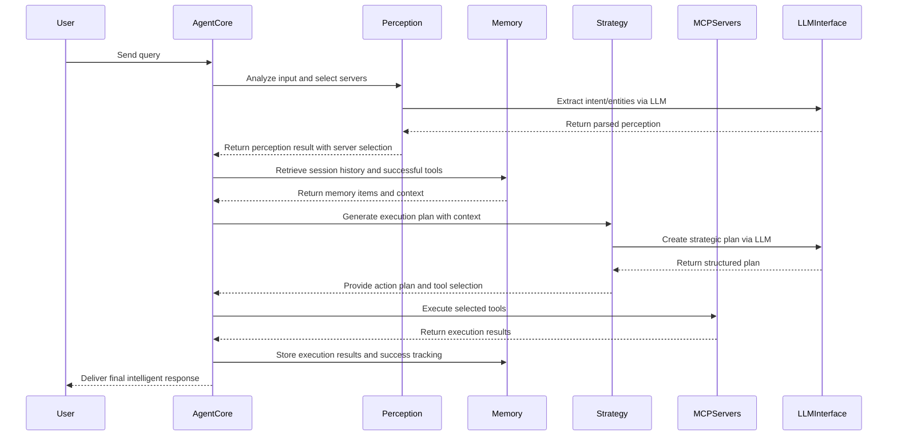
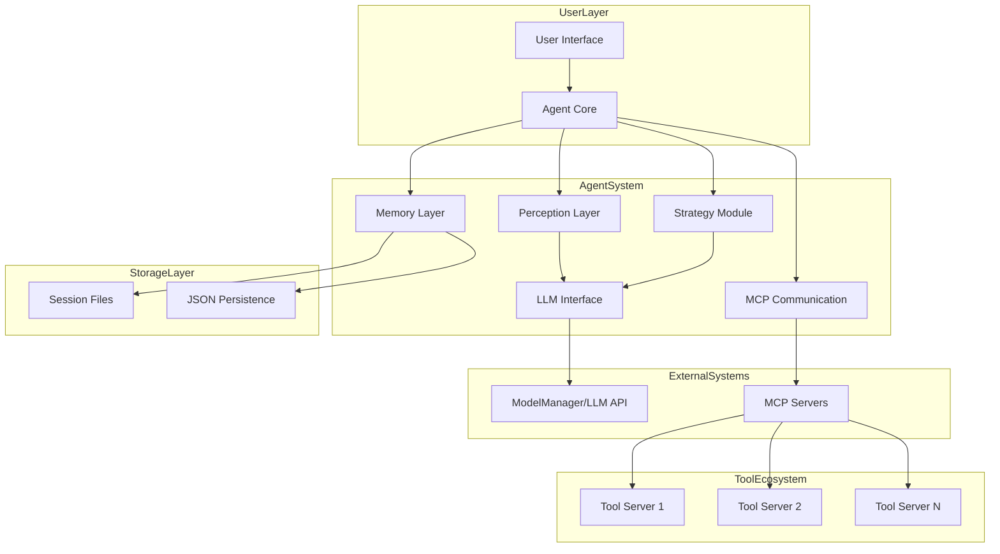

<think>Let me analyze the repository code to understand the agentic system architecture and create a comprehensive Markdown document. Based on the files provided, I can see:

1. **modules/perception.py**: Handles user input analysis and intent extraction, selects MCP servers
2. **modules/memory.py**: Manages session memory and tool execution history  
3. **modules/tools.py**: Utility functions for tool handling and prompt management
4. **core/session.py**: MCP client management for tool execution
5. **core/strategy.py**: Decision making and planning logic

The system appears to be an agentic framework that:
- Uses LLMs for reasoning and decision making (ModelManager)
- Implements memory management for context retention
- Integrates with MCP servers for tool execution
- Has strategic planning capabilities with different modes
- Handles perception of user input to select appropriate tools

Let me create the document following the requested structure.</think>
# Agentic System Architecture: LLM + RAG + MCP Integration

## Problem Statement

This agentic system solves the challenge of creating an intelligent agent that can understand complex user queries, maintain conversational context, and execute actions through external tools. The system addresses several key problems:

- **Query Understanding**: Analyzing user input to extract intent, entities, and determine appropriate tool selection
- **Context Retention**: Maintaining session memory across interactions to improve decision-making
- **Tool Orchestration**: Coordinating multiple MCP (Model Context Protocol) servers and tools based on query requirements  
- **Strategic Planning**: Implementing adaptive planning strategies with fallback mechanisms
- **Intelligent Response Generation**: Producing coherent responses through LLM integration with retrieved context

## Solution Overview

The system implements a modular agentic architecture that orchestrates three core components:

**LLM Integration**: Uses a centralized ModelManager for text generation, perception analysis, and strategic decision-making across all system components.

**RAG Components**: Implements memory-based retrieval through persistent session management, tool execution history, and success tracking to provide relevant context for decision-making.

**MCP Server Communication**: Provides seamless integration with multiple Model Context Protocol servers, enabling dynamic tool discovery and execution coordination.

### Key Goals Achieved:
- **Personalized Context**: Session-based memory management with tool performance tracking
- **Efficient Retrieval**: Smart tool filtering based on perception results and historical success patterns
- **Coordinated Response Generation**: Unified execution flow with strategic planning and error recovery

## System Architecture

The system consists of five major architectural components:

### Agent Core
Central orchestration layer that manages the overall execution flow, context handling, and strategic decision-making through the strategy module.

### LLM Interface  
Handles prompt generation, text completion, and response parsing through the ModelManager abstraction, supporting multiple LLM providers.

### Perception Layer
Analyzes user input to extract intent, entities, and intelligently selects relevant MCP servers for tool execution.

### Memory Layer (RAG Component)
Manages session state, tool execution history, and success tracking with persistent file-based storage organized by session hierarchy.

### MCP Communication Layer
Coordinates tool discovery and execution across multiple MCP servers with stateless connection management for reliability.

## Module Responsibilities

### Perception Module (`modules/perception.py`)
- **Purpose**: User input analysis, intent extraction, and MCP server selection
- **Inputs**: User query string, MCP server description mappings
- **Outputs**: PerceptionResult containing intent, entities, tool hints, and selected servers
- **Key Dependencies**: ModelManager for LLM-based analysis, prompt templates for structured extraction

```python:modules/perception.py
class PerceptionResult(BaseModel):
    intent: str
    entities: List[str] = []
    tool_hint: Optional[str] = None
    tags: List[str] = []
    selected_servers: List[str] = []
```

### Memory Management (`modules/memory.py`)
- **Purpose**: Session memory persistence, tool execution tracking, and success pattern analysis
- **Inputs**: Session ID, tool calls, execution results, success indicators
- **Outputs**: Memory items, recent successful tools, complete session history
- **Key Dependencies**: File system for JSON-based persistence, Pydantic for data validation

### Strategy Module (`core/strategy.py`)
- **Purpose**: Strategic planning with multiple modes (conservative, exploratory) and memory-based fallbacks
- **Inputs**: AgentContext, perception results, memory items, available tools
- **Outputs**: Execution plans with selected tools and strategic decisions
- **Key Dependencies**: ModelManager for plan generation, tool filtering utilities

### MCP Session Management (`core/session.py`)
- **Purpose**: Multi-server MCP communication and tool execution coordination
- **Inputs**: Server configurations, tool names, execution arguments
- **Outputs**: Tool execution results, available tool inventories
- **Key Dependencies**: MCP client libraries, stdio transport protocol

### Utility Layer (`modules/tools.py`)
- **Purpose**: Tool management utilities and prompt template handling
- **Inputs**: Tool collections, filter criteria, template file paths
- **Outputs**: Filtered tool sets, summarized descriptions, loaded prompts
- **Key Dependencies**: Regular expressions for parsing, file I/O operations

## Interactions and Data Flow

The system follows a structured data flow pattern from user input through context retrieval to intelligent response generation:



## Architecture Diagram



## Design and Patterns

### Frameworks and Technologies
- **Pydantic**: Data validation and serialization for all structured objects (MemoryItem, PerceptionResult, AgentContext)
- **Asyncio**: Asynchronous programming model for concurrent MCP server communication and LLM calls
- **MCP Protocol**: Model Context Protocol standard for tool server integration and communication
- **JSON-based Persistence**: Hierarchical file-based session memory storage with automatic directory creation

### Design Patterns and Architectural Decisions

**Strategy Pattern**: Multiple planning modes (conservative vs exploratory) implemented as pluggable strategies with different prompt templates and execution logic.

**Modular Architecture**: Clear separation of concerns between perception, memory, strategy, and execution layers with defined interfaces.

**Factory Pattern**: ModelManager abstraction enables support for multiple LLM providers without changing core logic.

**Stateless Communication**: Each MCP tool call creates fresh server connections, ensuring reliability and preventing state corruption.

**Memory-driven RAG**: Session-based persistent storage provides context retrieval based on execution history rather than traditional vector embeddings.

### Key Design Decisions
- **Hierarchical Session Storage**: Memory organized by session ID components for efficient organization and cleanup
- **Fallback Mechanisms**: Multiple levels of fallback including memory-based tool selection and strategic replanning
- **Dynamic Tool Filtering**: Combination of hint-based and server-based filtering for optimal tool selection
- **Success Tracking**: Explicit tracking of tool execution success to improve future decision-making

## Summary and Onboarding

### Setup Steps
```bash
# Install core dependencies
pip install pydantic asyncio mcp-client

# Initialize memory directory structure
mkdir -p memory/{session-prefix}/{session-middle}/{session-suffix}

# Configure MCP servers
# Edit server_configs in MultiMCP initialization
```

### Entry Points
```python:main.py
# Initialize the agentic system
from core.session import MultiMCP
from modules.memory import MemoryManager
from modules.perception import run_perception

# Main execution flow
async def run_agent(session_id: str, user_input: str):
    memory = MemoryManager(session_id)
    mcp = MultiMCP(server_configs)
    await mcp.initialize()
    # Process user input through perception -> strategy -> execution
```

### Adding New Modules

**Adding Custom Retrieval Components**:
```python:modules/custom_retrieval.py
class CustomRAGRetriever:
    async def retrieve_context(self, query: str, session_id: str) -> List[str]:
        # Implement vector-based or semantic retrieval
        # Integrate with existing memory management
        pass
```

**Extending LLM Support**:
```python:modules/model_manager.py
class ModelManager:
    def register_provider(self, name: str, api_config: dict):
        # Add new LLM provider (OpenAI, Anthropic, local models)
        self.providers[name] = api_config
```

**Adding New MCP Servers**:
```python:config/servers.py
server_configs = [
    {
        "id": "document_server",
        "script": "servers/document_mcp_server.py", 
        "description": "Document search and analysis tools",
        "cwd": "/path/to/server/directory"
    }
]
```

### Development Guidelines
- Follow async/await patterns for all I/O operations
- Implement comprehensive error handling with graceful fallbacks  
- Use Pydantic models for all data structures requiring validation
- Maintain session isolation in memory management
- Test MCP integration with proper server mocking
- Document new tool capabilities in server descriptions