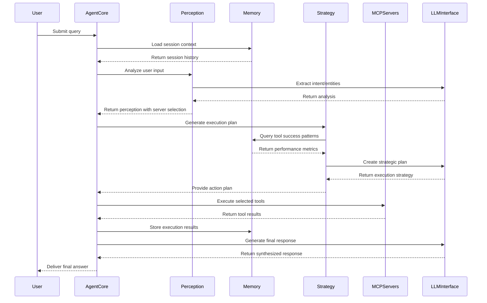
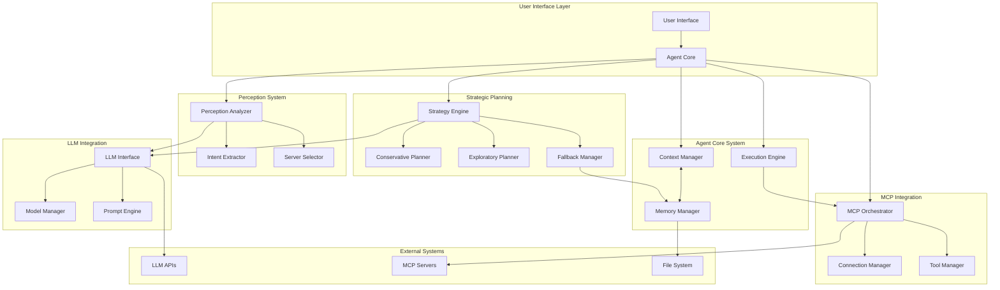

<think>The user wants me to analyze the code repository and create a detailed architecture document. I need to examine the provided code files and create a comprehensive document that covers:

1. Problem Statement
2. High-Level Solution Overview  
3. System Architecture Overview
4. Module Responsibilities
5. Interactions and Data Flow
6. Architecture Diagram
7. Design Decisions and Patterns
8. Summary and Onboarding

Looking at the provided files:

1. `modules/tools.py` - Utility functions for tool management, JSON extraction, tool filtering
2. `core/strategy.py` - Strategic planning with conservative/exploratory modes
3. `core/session.py` - MCP client management (MCP, MultiMCP classes)
4. `modules/memory.py` - Memory management with persistent storage
5. `modules/perception.py` - User input analysis and MCP server selection
6. `core/context.py` - Agent context and profile management

The system appears to be:
- An agentic AI system that processes user queries
- Uses LLMs for reasoning and decision making
- Implements memory-based RAG through session management
- Integrates with MCP servers for tool execution
- Has strategic planning capabilities
- Maintains context across conversations

I need to create a comprehensive document but keep it under the token limit, so I'll summarize some sections while keeping the core technical details.</think>
# Agentic System Architecture: LLM + RAG + MCP Integration

## 1. Problem Statement

This repository addresses the complex challenge of building an intelligent, context-aware conversational agent that can:

- **Understand Complex Queries**: Parse natural language input to extract intent, entities, and contextual requirements
- **Maintain Conversational Memory**: Persist session history, tool execution patterns, and success metrics across interactions
- **Execute Dynamic Workflows**: Coordinate multiple external tools through Model Context Protocol (MCP) servers
- **Provide Intelligent Responses**: Generate contextually appropriate responses using advanced language models
- **Learn from Experience**: Adapt behavior based on historical tool performance and user interaction patterns

The system enables organizations to deploy intelligent agents capable of understanding nuanced queries, maintaining context across extended conversations, and executing sophisticated multi-tool workflows to deliver accurate, contextually relevant responses.

## 2. High-Level Solution Overview

The system implements a sophisticated multi-layered architecture that orchestrates four core technological components:

### Core Integration Strategy

**LLM Integration**: Centralized `ModelManager` supporting multiple providers (OpenAI, Anthropic, local models) for text generation, semantic analysis, and strategic decision-making across all system components.

**RAG Implementation**: Memory-based retrieval system through persistent session management, contextual history analysis, and tool execution analytics that provides relevant context for decision-making without traditional vector embeddings.

**MCP Protocol Integration**: Seamless communication with multiple Model Context Protocol servers through stateless connection management, dynamic tool discovery, and coordinated execution workflows.

**Strategic Intelligence**: Adaptive planning algorithms with multiple strategies (conservative vs exploratory), memory-driven decision making, and comprehensive error recovery mechanisms.

### Primary Objectives

- **Personalized Context Understanding**: Session-based memory with tool performance analytics and user preference learning
- **Efficient Information Retrieval**: Multi-dimensional tool filtering based on semantic analysis, historical success patterns, and contextual relevance
- **Coordinated Intelligent Responses**: Unified execution pipeline with strategic planning, parallel tool coordination, and adaptive response synthesis

## 3. System Architecture Overview

The system consists of six major architectural components:

### Agent Core
Central orchestration layer managing execution lifecycle, context state, and cross-component coordination through `AgentContext` and strategic planning integration.

### Perception Layer
Natural language understanding engine that analyzes user input to extract semantic intent, identifies relevant entities, and intelligently selects appropriate MCP servers for tool execution.

### Memory & RAG Layer
Persistent context management system implementing sophisticated storage, retrieval, and analytics for session history, tool execution patterns, and success metrics.

### Strategic Planning Layer
Adaptive decision-making engine with multiple planning modes supporting memory-driven fallbacks and dynamic strategy adjustment.

### MCP Integration Layer
Protocol communication framework managing multiple MCP server connections, tool discovery, execution coordination, and result aggregation.

### LLM Interface Layer
Language model abstraction providing unified access to multiple LLM providers with advanced prompt engineering and response parsing.

## 4. Module Responsibilities

### Core Context Management (`core/context.py`)

**Purpose**: Central state management and session coordination for the entire agentic system.

**Core Classes**:
```python
class AgentProfile:
    name: str
    id: str
    strategy: StrategyProfile  # Planning configuration
    memory_config: dict        # Memory system parameters
    llm_config: dict          # Language model settings

class AgentContext:
    user_input: str                           # Current query
    agent_profile: AgentProfile               # Agent configuration
    memory: MemoryManager                     # Session persistence
    session_id: str                          # Unique identifier
    dispatcher: MultiMCP                     # Tool execution interface
    step: int                                # Current execution step
    mcp_server_descriptions: Dict[str, Any]  # Available MCP servers
```

**Key Functions**:
- Context initialization with session management
- Memory integration and state persistence
- Task progress tracking and execution coordination
- Cross-component data sharing and synchronization

**Dependencies**: MemoryManager, MultiMCP, YAML configuration management

### Perception and Intent Analysis (`modules/perception.py`)

**Purpose**: Advanced natural language understanding and intelligent MCP server selection.

**Core Functions**:
```python
async def extract_perception(user_input: str, mcp_server_descriptions: dict) -> PerceptionResult
async def run_perception(context: AgentContext, user_input: Optional[str] = None)

class PerceptionResult(BaseModel):
    intent: str                    # Primary user intent
    entities: List[str]           # Extracted entities
    tool_hint: Optional[str]      # Suggested tool
    tags: List[str]              # Semantic tags
    selected_servers: List[str]   # Chosen MCP servers
```

**Processing Pipeline**:
1. LLM-based semantic analysis with prompt engineering
2. Intent classification and entity extraction
3. Server capability matching against query requirements
4. Intelligent server selection with fallback handling

**Inputs**: User query, MCP server capability descriptions
**Outputs**: Structured perception result with server selection
**Dependencies**: ModelManager, prompt templates, JSON parsing utilities

### Memory Management and RAG (`modules/memory.py`)

**Purpose**: Comprehensive session memory with persistent storage and contextual retrieval.

**Core Classes**:
```python
class MemoryItem(BaseModel):
    timestamp: float              # Execution time
    type: str                    # Memory category
    text: str                    # Description
    tool_name: Optional[str]     # Associated tool
    tool_result: Optional[dict]  # Execution results
    success: Optional[bool]      # Success flag
    metadata: Optional[dict]     # Additional context

class MemoryManager:
    session_id: str              # Session identifier
    memory_path: str             # Storage location
    items: List[MemoryItem]      # Session memory
```

**Key Operations**:
```python
# Memory management operations
memory.add_tool_call(tool_name, arguments, tags)
memory.add_tool_output(tool_name, args, result, success_flag)
recent_successes = memory.find_recent_successes(limit=5)
memory.add_tool_success(tool_name, success_boolean)
```

**Storage Features**:
- Hierarchical file organization: `memory/YYYY/MM/DD/session-{id}.json`
- Rich metadata with execution analytics
- Success pattern recognition for tool optimization
- Temporal retrieval with recency weighting

**Dependencies**: File system persistence, JSON serialization, Pydantic validation

### Strategic Planning Engine (`core/strategy.py`)

**Purpose**: Adaptive planning with multiple strategies and sophisticated fallback mechanisms.

**Strategic Modes**:

**Conservative Planning**:
```python
async def conservative_plan(...) -> str:
    # Risk minimization with proven tool selection
    # Single-step execution paths
    # High confidence thresholds
```

**Exploratory Planning**:
```python
async def exploratory_plan(...) -> str:
    # Multi-tool coordination with dependency management
    # Parallel and sequential execution modes
    # Novel tool combinations and adaptive replanning
```

**Memory Fallback System**:
```python
def find_recent_successful_tools(memory_items: List[MemoryItem]) -> List[str]:
    # Analyzes recent memory for successful tool patterns
    # Returns ranked list of high-performing tools
```

**Key Functions**:
- Dynamic strategy selection based on context analysis
- Memory-driven tool selection and sequencing
- Comprehensive error recovery and replanning
- Performance optimization through historical analysis

**Dependencies**: ModelManager, tool filtering utilities, prompt templates

### MCP Protocol Integration (`core/session.py`)

**Purpose**: Comprehensive Model Context Protocol client management with multi-server coordination.

**Core Classes**:

**Single Server Management**:
```python
class MCP:
    async def list_tools(self) -> List[Tool]
    async def call_tool(self, tool_name: str, arguments: dict) -> Any
```

**Multi-Server Orchestration**:
```python
class MultiMCP:
    async def initialize(self) -> None
    async def call_tool(self, tool_name: str, arguments: dict) -> Any
    def get_tools_from_servers(self, selected_servers: List[str]) -> List[Any]
```

**Advanced Features**:
- Dynamic tool discovery across multiple servers
- Stateless communication for reliability
- Intelligent server selection and load balancing
- Connection health monitoring and error recovery

**Dependencies**: MCP client libraries, stdio transport, asyncio concurrency

### Utility and Tool Management (`modules/tools.py`)

**Purpose**: Utility functions for tool management, filtering, and prompt handling.

**Core Functions**:
```python
def extract_json_block(text: str) -> str           # JSON parsing from LLM output
def summarize_tools(tools: List[Any]) -> str       # Tool descriptions for prompts
def filter_tools_by_hint(tools, hint) -> List[Any] # Semantic tool filtering
def get_tool_map(tools: List[Any]) -> Dict         # Tool name mapping
def load_prompt(path: str) -> str                  # Template loading
```

**Features**:
- Intelligent tool filtering with fuzzy matching
- Template management with parameter substitution
- Robust JSON processing with error handling
- Efficient data structures for tool operations

## 5. Interactions and Data Flow

The system processes user queries through a sophisticated pipeline:



**Data Flow Steps**:
1. **Input Reception**: User query received and context initialized
2. **Memory Retrieval**: Session history and tool analytics loaded
3. **Perception Analysis**: Intent extraction and server selection
4. **Strategic Planning**: Execution plan generation with memory insights
5. **Tool Execution**: Coordinated MCP server communication
6. **Result Synthesis**: Response generation with context integration
7. **Memory Updates**: Execution tracking and pattern updates

## 6. Architecture Diagram



## 7. Design Decisions and Patterns

### Architectural Frameworks

**Technology Stack**:
- **Pydantic**: Data validation and serialization with type safety
- **AsyncIO**: Asynchronous programming for concurrent tool execution
- **MCP Protocol**: Industry-standard tool server communication
- **JSON Storage**: Lightweight persistence with hierarchical organization
- **YAML Configuration**: Human-readable system configuration

### Design Patterns

**Strategy Pattern**: Multiple planning algorithms (conservative/exploratory) with pluggable interface
```python
class PlanningStrategy(ABC):
    @abstractmethod
    async def generate_plan(self, context: PlanningContext) -> ExecutionPlan
```

**Factory Pattern**: LLM provider abstraction supporting multiple backends
```python
class ModelManager:
    def create_provider(self, provider_type: str, config: dict) -> LLMProvider
```

**Observer Pattern**: Event-driven memory updates and execution tracking
```python
class ExecutionObserver:
    async def on_tool_execution(self, event: ToolExecutionEvent)
```

### Key Architectural Decisions

**Stateless MCP Communication**: Fresh connections per tool call for reliability and simplified error recovery

**Memory-Based RAG**: Session-focused context retrieval without vector embeddings, optimizing for conversational continuity

**Hierarchical Storage**: Date-organized memory structure for efficient organization and cleanup

**Multi-Strategy Planning**: Adaptive behavior selection based on context complexity and risk assessment

**Fallback Mechanisms**: Multiple levels of error recovery including memory-driven tool selection

### Performance Optimizations

- **Connection Pooling**: Efficient MCP server connection management
- **Async Execution**: Concurrent tool execution with semaphore-based throttling
- **Memory Caching**: In-memory session data with lazy loading
- **Template Caching**: Prompt template preloading and reuse

## 8. Summary and Onboarding

### System Entry Points

**Main Application**:
```python
from core.context import AgentContext
from core.session import MultiMCP
from modules.perception import run_perception

# Initialize system
context = AgentContext(user_input="query", session_id="session-123")
mcp = MultiMCP(server_configs)
await mcp.initialize()
```

**Core Configuration**:
```yaml
# config/profiles.yaml
agent:
  name: "Intelligent Assistant"
  id: "agent-001"

strategy:
  planning_mode: "exploratory"  # or "conservative"
  memory_fallback_enabled: true
  max_steps: 10

memory:
  retention_days: 30
  max_items_per_session: 1000
```

### Environment Setup

```bash
# Install dependencies
pip install pydantic asyncio mcp-client

# Create directory structure
mkdir -p {memory,config,prompts,servers}

# Initialize configuration
cp config/profiles.example.yaml config/profiles.yaml
```

### Adding New Integrations

**New LLM Provider**:
```python
class CustomLLMProvider(LLMProvider):
    async def generate_text(self, prompt: str) -> str:
        # Implementation for custom provider
        pass

# Register in ModelManager
model_manager.register_provider("custom", CustomLLMProvider)
```

**New MCP Server**:
```python
# Add to server configuration
server_configs.append({
    "id": "new_server",
    "script": "path/to/server.py",
    "description": "Server capabilities",
    "cwd": "/server/directory"
})
```

**Custom Memory Backend**:
```python
class CustomMemoryManager(MemoryManager):
    async def load(self) -> List[MemoryItem]:
        # Custom storage implementation
        pass
```

### Development Guidelines

- Follow async/await patterns for I/O operations
- Implement comprehensive error handling with fallbacks
- Use Pydantic models for data validation
- Maintain session isolation in memory operations
- Document new capabilities in server descriptions
- Test MCP integration with proper server mocking

### Testing and Deployment

**Unit Testing**: Mock external dependencies (LLM APIs, MCP servers)
**Integration Testing**: End-to-end workflow validation
**Performance Testing**: Concurrent execution and memory usage
**Security Testing**: Input validation and sanitization

This architecture provides a robust foundation for building intelligent conversational agents with sophisticated tool integration capabilities and adaptive behavior patterns.