# Agentic System Architecture: LLM + RAG + MCP Integration

## Files Available in Repository Context:

### Core System Files:
- `core/context.py` - Agent context and profile management
- `core/session.py` - MCP client management and orchestration
- `core/strategy.py` - Strategic planning engine

### Module Files:
- `modules/model_manager.py` - LLM provider management
- `modules/perception.py` - User input analysis and intent extraction
- `modules/memory.py` - Session memory and persistence
- `modules/tools.py` - Utility functions and tool management
- `modules/mcp_server_memory.py` - MCP server memory functionality

### MCP Server Implementations:
- `mcp_server_1.py` - Mathematical functions (Fibonacci, trigonometry)
- `mcp_server_2.py` - Document processing and semantic search
- `mcp_server_3.py` - Web search functionality

### Data Models:
- `models.py` - Pydantic models for tool inputs/outputs

### Documentation & Content:
- `README.md` - System overview and architecture
- `README2.md` - Additional architecture details
- `documents/markitdown.md` - MarkItDown tool documentation
- `documents/economic.md` - Economic analysis content
- `documents/dlf.md` - DLF company information

---

# Agentic System Architecture: LLM + RAG + MCP Integration

## 1. Problem Statement

This repository implements a sophisticated intelligent agent system addressing the challenge of creating context-aware conversational AI capable of:

- **Multi-Domain Query Understanding**: Semantic analysis across mathematical computation, document processing, web search, and business intelligence domains
- **Persistent Context Management**: Hierarchical session memory with tool execution analytics and success pattern recognition
- **Dynamic Multi-Tool Orchestration**: Coordination of specialized MCP servers for document analysis, mathematical computation, web search, and memory management
- **Adaptive Strategic Planning**: Conservative and exploratory execution modes with memory-driven fallbacks and real-time optimization
- **Advanced Document Intelligence**: PDF processing, semantic search, vector embeddings, and multi-format document conversion
- **Continuous Learning**: Performance analytics and success pattern recognition for improved decision-making

## 2. High-Level Solution Overview

The system orchestrates six core technological pillars:

**Advanced LLM Integration**: Multi-provider ModelManager (Gemini, Ollama) with intelligent prompt engineering and response parsing

**Hybrid RAG Implementation**: Memory-based session context combined with FAISS vector search for document retrieval

**Comprehensive MCP Ecosystem**: Specialized servers for document processing, mathematical computation, web search, and memory management

**Adaptive Strategic Intelligence**: Multi-mode planning with memory-driven optimization and sophisticated fallback mechanisms

**Document Processing Pipeline**: MarkItDown integration with semantic chunking, OCR, and vector search capabilities

**Multi-Modal Tool Integration**: Seamless coordination of diverse computational tools and external services

## 3. System Architecture Overview

### Agent Core Layer
Central orchestration with AgentContext, AgentProfile, and execution lifecycle management

### Perception Layer  
Advanced NLU with intent extraction, entity recognition, and intelligent MCP server selection

### Memory & RAG Layer
Hierarchical session storage with tool performance analytics and contextual retrieval

### Strategic Planning Layer
Adaptive decision-making with conservative/exploratory modes and memory-driven fallbacks

### MCP Integration Layer
Multi-server coordination with stateless communication and dynamic tool discovery

### Document Processing Layer
Advanced document intelligence with multi-format support and semantic search

### Tool Ecosystem Layer
Specialized computation servers for mathematical operations, document analysis, and web search

## 4. Module Responsibilities

### Core Context Management (`core/context.py`)

**Key Classes**:
```python
class AgentProfile:
    name: str
    strategy: StrategyProfile
    memory_config: dict
    llm_config: dict

class AgentContext:
    user_input: str
    agent_profile: AgentProfile
    memory: MemoryManager
    session_id: str
    dispatcher: MultiMCP
    step: int
    task_progress: List[dict]
```

**Responsibilities**: Session lifecycle, context state management, cross-component coordination

### Perception System (`modules/perception.py`)

**Core Function**:
```python
async def extract_perception(user_input: str, mcp_server_descriptions: dict) -> PerceptionResult

class PerceptionResult(BaseModel):
    intent: str
    entities: List[str]
    tool_hint: Optional[str]
    selected_servers: List[str]
```

**Responsibilities**: Intent classification, entity extraction, intelligent server selection

### Memory Management (`modules/memory.py`)

**Key Operations**:
```python
class MemoryManager:
    def add_tool_call(self, tool_name: str, tool_args: dict, tags: Optional[List[str]])
    def add_tool_output(self, tool_name: str, tool_result: dict, success: bool)
    def find_recent_successes(self, limit: int = 5) -> List[str]
```

**Storage**: Hierarchical organization (`memory/YYYY/MM/DD/session-{id}.json`)

### Strategic Planning (`core/strategy.py`)

**Planning Modes**:
- **Conservative**: Single-tool execution with proven patterns
- **Exploratory**: Multi-tool coordination with parallel/sequential execution
- **Memory Fallback**: Historical success pattern analysis

### MCP Integration (`core/session.py`)

**Multi-Server Orchestration**:
```python
class MultiMCP:
    async def initialize(self) -> None
    async def call_tool(self, tool_name: str, arguments: dict) -> Any
    def get_tools_from_servers(self, selected_servers: List[str]) -> List[Any]
```

### Document Processing Server (`mcp_server_2.py`)

**Core Capabilities**:
- PDF extraction with MarkItDown integration
- FAISS-based semantic search with vector embeddings
- Intelligent semantic chunking with LLM-powered topic detection
- OCR and image processing

### Mathematical Server (`mcp_server_1.py`)

**Functions**: Fibonacci sequences, trigonometric calculations, mathematical operations

### Web Search Server (`mcp_server_3.py`)

**Capabilities**: DuckDuckGo search integration with rate limiting and result formatting

## 5. Interactions and Data Flow


## Sequence Diagram Key Features

### 🔧 **Phase 1: Context Initialization**
- Hierarchical session ID generation with timestamp and unique identifier
- Comprehensive memory loading with pattern analysis and success metrics
- Performance analytics calculation for informed decision making

### 🔍 **Phase 2: Semantic Analysis**
- Parallel intent classification and entity extraction using LLM inference
- Intelligent MCP server selection with capability matching and health monitoring
- Advanced prompt engineering with context injection and optimization

### 🎲 **Phase 3: Strategic Planning**
- Dynamic strategy selection between conservative and exploratory modes
- Memory-driven tool selection based on historical success patterns
- Comprehensive fallback strategy preparation with alternative tool options

### 🔌 **Phase 4: Tool Execution**
- Parallel multi-server execution with connection pooling and health monitoring
- Coordinated tool execution across document processing, mathematical computation, web search, and memory management servers
- Real-time result aggregation and validation with performance metrics

### ⚠️ **Phase 5: Error Recovery**
- Sophisticated fallback mechanisms with alternative tool selection
- Memory-driven error recovery using historical success patterns
- Dynamic replanning and re-execution with optimized parameters

### 🎭 **Phase 6: Response Synthesis**
- Advanced response generation with context integration and optimization
- Multi-stage response parsing and quality validation
- Comprehensive formatting and structuring for optimal user experience

### 📊 **Phase 7: Analytics & Learning**
- Continuous performance monitoring with success pattern updates
- Strategy effectiveness evaluation and parameter optimization
- System-wide metrics collection and anomaly detection

### 🧹 **Phase 8: Cleanup & Optimization**
- Automated session cleanup with archival and consolidation
- Resource optimization and performance tuning
- Preparation for subsequent interactions with optimized state

This comprehensive sequence diagram captures the full complexity of the agentic system's execution flow, including error handling, parallel processing, continuous learning, and optimization mechanisms.


## 6. Architecture Diagram

1. All the modules and their internal components
2. Data flow between components
3. External systems and integrations
4. Storage layers
5. The MCP server ecosystem
6. Internal connections and dependencies

```mermaid
graph TD
    subgraph UserLayer["👤 User Layer"]
        USER[User Interface]
    end
    
    subgraph CoreSystem["🧠 Agent Core System"]
        AC[Agent Controller]
        CTX[Context Manager]
        EXEC[Execution Engine]
    end
    
    subgraph IntelligenceLayer["🤖 Intelligence Layer"]
        PERC[Perception System]
        STRAT[Strategy Engine]
        LLM[LLM Interface]
    end
    
    subgraph DataLayer["💾 Data Layer"]
        MEM[Memory Manager]
        STORAGE[File Storage]
    end
    
    subgraph ToolLayer["🛠️ Tool Execution Layer"]
        MCP[MCP Orchestrator]
        DOC[Document Server]
        MATH[Math Server]
        WEB[Web Server]
    end
    
    subgraph ExternalSystems["🌐 External Systems"]
        LLMAPI[LLM APIs]
        FILES[File System]
    end
    
    %% Core Connections
    USER --> AC
    AC --> CTX
    AC --> EXEC
    
    %% Intelligence Connections
    AC --> PERC
    AC --> STRAT
    PERC --> LLM
    STRAT --> LLM
    
    %% Data Connections
    AC --> MEM
    MEM --> STORAGE
    STORAGE --> FILES
    
    %% Tool Connections
    EXEC --> MCP
    MCP --> DOC
    MCP --> MATH
    MCP --> WEB
    
    %% External Connections
    LLM --> LLMAPI
    
    %% Cross-layer Connections
    STRAT --> MEM
    PERC --> MCP
    
    style AC fill:#e1f5fe
    style PERC fill:#f3e5f5
    style MEM fill:#e8f5e8
    style STRAT fill:#fff3e0
    style MCP fill:#fce4ec
    style LLM fill:#f1f8e9
```



## Detailed Component Breakdown

### 🧠 Agent Core System Components

**Agent Core Controller**: Central orchestration hub managing all system interactions
- Coordinates between perception, memory, strategy, and execution layers
- Manages session lifecycle and state transitions
- Handles error propagation and recovery mechanisms

**Context Manager**: Maintains comprehensive execution context
- Tracks user input, session state, and execution progress
- Manages agent profile configurations and capabilities
- Coordinates cross-component data sharing

**Execution Engine**: Orchestrates tool execution workflows
- Manages parallel and sequential tool execution
- Handles timeout management and resource allocation
- Coordinates result aggregation and synthesis

### 🔍 Perception System Details

**Intent Classifier**: Advanced NLU for query understanding
- Multi-class intent recognition with confidence scoring
- Contextual analysis with entity relationship mapping
- Ambiguity detection and resolution mechanisms

**Server Selector**: Intelligent MCP server selection
- Capability matching against available server tools
- Load balancing and performance optimization
- Fallback selection for high availability

**Confidence Scorer**: Multi-dimensional confidence assessment
- Intent classification confidence with uncertainty quantification
- Server selection confidence with capability overlap analysis
- Overall perception confidence for strategic planning

### 🧮 Memory & RAG System Architecture

**Hierarchical Storage**: Date-organized memory structure
- Automatic directory creation and cleanup
- Efficient retrieval with temporal indexing
- Compression and archival for old sessions

**Pattern Analyzer**: Machine learning-ready analytics
- Tool success pattern recognition
- Temporal trend analysis and seasonality detection
- Performance prediction modeling

**Context Synthesizer**: Intelligent context compilation
- Relevant memory item selection and ranking
- Context window optimization for LLM prompts
- Dynamic context adaptation based on query complexity

### 🎲 Strategic Planning Engine

**Conservative Planner**: Risk-minimized execution strategy
- Single-tool execution with proven success patterns
- High confidence thresholds and conservative tool selection
- Minimal resource consumption with predictable outcomes

**Exploratory Planner**: Advanced multi-tool coordination
- Parallel execution with dependency management
- Sequential discovery with adaptive planning
- Novel tool combinations with calculated risk assessment

**Adaptive Controller**: Real-time strategy optimization
- Dynamic strategy switching based on execution feedback
- Performance-based parameter adjustment
- Continuous learning from execution outcomes

### 🔌 MCP Integration System

**Connection Manager**: Robust server communication
- Connection pooling with health monitoring
- Automatic retry logic with exponential backoff
- Session management and cleanup

**Tool Discovery**: Dynamic capability mapping
- Real-time tool enumeration across all servers
- Capability classification and metadata extraction
- Tool dependency analysis and resolution

**Request Router**: Intelligent request distribution
- Server selection based on tool requirements
- Load balancing with performance optimization
- Fallback routing for server failures

### 📚 Document Processing Pipeline

**Semantic Chunker**: Intelligent document segmentation
- LLM-powered topic boundary detection
- Context-preserving chunk sizing optimization
- Smart overlap management for coherence

**Embedding Generator**: High-performance vectorization
- Optimized embedding generation for search
- Batch processing for large document sets
- Vector normalization and optimization

**Vector Search Engine**: FAISS-based similarity search
- High-performance approximate nearest neighbor search
- Dynamic index management and optimization
- Multi-vector query support with ranking

### 🤖 LLM Integration System

**Model Manager**: Multi-provider orchestration
- Dynamic provider selection based on task requirements
- API key management and authentication
- Performance monitoring and optimization

**Prompt Engine**: Advanced prompt engineering
- Template-based prompt construction
- Context injection and parameter substitution
- Prompt optimization based on model capabilities

**Response Parser**: Structured output processing
- JSON extraction with multiple fallback strategies
- Schema validation and error recovery
- Response quality assessment and filtering

This comprehensive architecture provides a robust foundation for building intelligent conversational agents with sophisticated tool integration capabilities, adaptive behavior patterns, and continuous learning mechanisms.

## 7. Design Decisions and Patterns

### Technology Stack
- **Pydantic**: Data validation and serialization
- **AsyncIO**: Concurrent execution and I/O operations
- **MCP Protocol**: Standardized tool server communication
- **FAISS**: High-performance vector search
- **MarkItDown**: Multi-format document conversion

### Design Patterns
- **Strategy Pattern**: Multiple planning algorithms with pluggable interface
- **Factory Pattern**: LLM provider abstraction
- **Observer Pattern**: Event-driven memory updates
- **Command Pattern**: Tool execution with request/response handling

### Key Decisions
- **Stateless MCP Communication**: Fresh connections for reliability
- **Hierarchical Memory Storage**: Date-organized structure for efficiency
- **Multi-Strategy Planning**: Adaptive behavior based on context
- **Memory-Driven Fallbacks**: Historical success patterns for optimization

## 8. Summary and Onboarding

### Setup
```bash
# Install dependencies
pip install pydantic asyncio mcp-client faiss-cpu

# Initialize directories
mkdir -p {memory,config,prompts,servers,documents}

# Configure servers
cp config/profiles.example.yaml config/profiles.yaml
```

### Entry Points
```python
# Initialize system
from core.context import AgentContext
from core.session import MultiMCP

context = AgentContext(user_input="query")
mcp = MultiMCP(server_configs)
await mcp.initialize()
```

### Adding New Components

**New LLM Provider**:
```python
class CustomLLMProvider:
    async def generate_text(self, prompt: str) -> str:
        pass
```

**New MCP Server**:
```python
server_configs.append({
    "id": "new_server",
    "script": "path/to/server.py", 
    "description": "Server capabilities"
})
```

### Development Guidelines
- Use async/await for I/O operations
- Implement error handling with fallbacks
- Follow Pydantic models for validation
- Maintain session isolation
- Test with proper mocking

This architecture provides a robust foundation for building intelligent conversational agents with sophisticated tool integration, adaptive behavior, and continuous learning capabilities.
